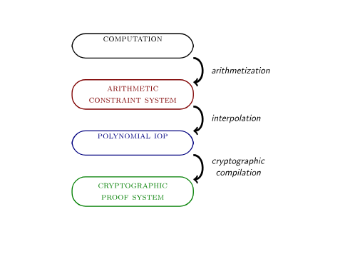

## Interactive proof system

- In computational complexity theory, an interactive proof system is a protocol between at least two parties in which one party, the verifier, is convinced of the correctness of a certain mathematical claim if and only if that claim is true.

- A cryptographic proof system turns this abstract notion of interactive proof systems into a concrete object intended for deployment. 

- A claim instead becomes “circuit C gives output y when evaluated on input x”. => Establishes Computational Integrity.

- Usually Verifier sends random Messages but we can replace it and make it noninteractive with Fiat-Shamir Trnasform 

- It is acceptable for the verifier to have a nonzero but negligibly small false positive or false negative rate

- Verifier should have a reason for verifying instead of re-running computation (time,resources etc). Verifying should have faster time complexity => Succint

- Zero Knowledge :The verifier is convinced of the truth of a computational claim while learning no information about some or all of the inputs to that computation.

-----

## STARK Overview

- Scalable Transparent ARgument of Knowledge.

- Scalable - Prover has running time of at most quasilinear and Verification time is poly-logarithmic.

- Transparent - All verifier messages are publicly sampled random (psuedorandom but can be considered random as we see later) => No Trusted setup and no cryptographic waste



```
Computation -> Program(Generally consists of instructions that determine how a machine manipulates its resources),input,output

Arithmetiation -> Turn compuation into equivalent equations on finite fields.

Interpolation and IOPs -> Representation of the arithmetic constraint system in term of polynomials. IOPs will be explained later
